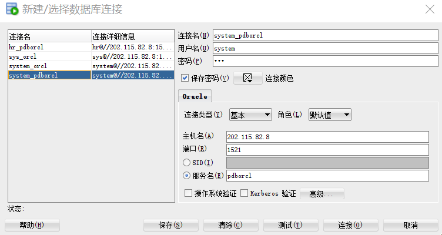
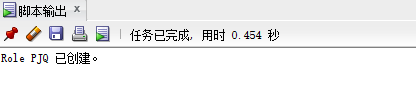
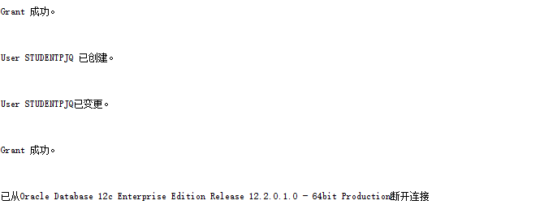
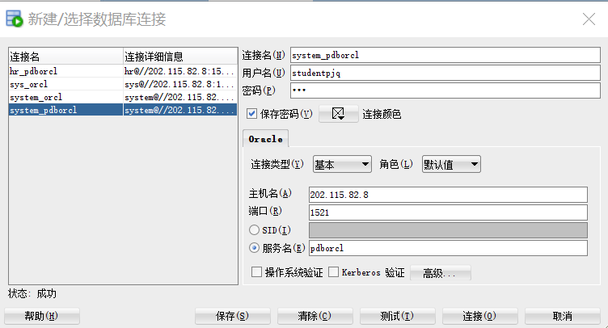
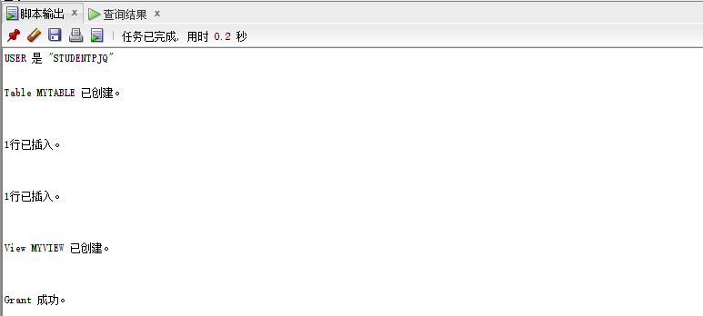
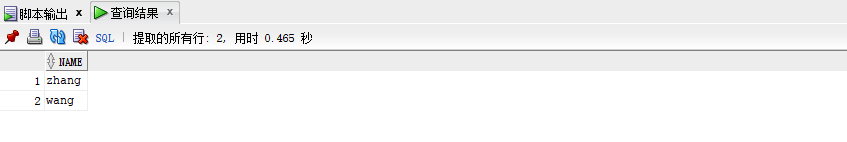
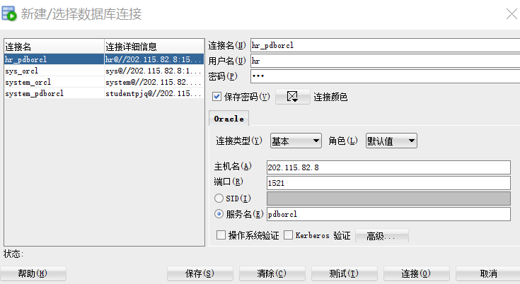
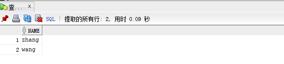
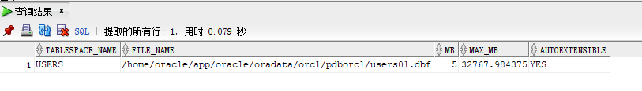
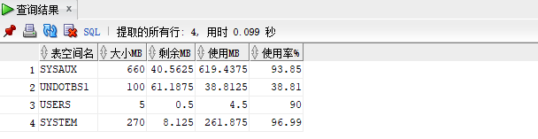

# 实验2：用户及权限管理
## 2018软件工程1班 彭嘉绮 201810215310
## 实验目的：
掌握用户管理、角色管理、权根维护与分配的能力，掌握用户之间共享对象的操作技能。
## 实验内容：
Oracle有一个开发者角色resource，可以创建表、过程、触发器等对象，但是不能创建视图。本训练要求：
1. 在pdborcl插接式数据中创建一个新的本地角色con_res_view，该角色包含connect和resource角色，同时也包含CREATE VIEW权限，这样任何拥有con_res_view的用户就同时拥有这三种权限。
2. 创建角色之后，再创建用户new_user，给用户分配表空间，设置限额为50M，授予con_res_view角色。
3. 最后测试：用新用户new_user连接数据库、创建表，插入数据，创建视图，查询表和视图的数据。
## 实验步骤：

- **第1步：以system登录到pdborcl，创建角色pjq和用户studentpjq，并授权和分配空间：**

  **system登录：**
  

  代码：

  ```sql
  CREATE ROLE pjq;
  GRANT connect,resource,CREATE VIEW TO pjq;
  CREATE USER studentpjq IDENTIFIED BY 123 DEFAULT     TABLESPACE users TEMPORARY TABLESPACE temp;
  ALTER USER studentpjq QUOTA 50M ON users;
  GRANT pjq TO studentpjq;
  exit;
  ```
  运行结果：
  
  


- **第2步：新用户studentpjq接到pdborcl，创建表mytable和视图myview，插入数据，最后将myview的SELECT对象权限授予hr用户**。
  
  **studentpjq登录：**

    

  代码：  

  ```sql
  show user;
  CREATE TABLE mytable (id number,name varchar(50));
  INSERT INTO mytable(id,name)VALUES(1,'zhang');
  INSERT INTO mytable(id,name)VALUES (2,'wang');
  CREATE VIEW myview AS SELECT name FROM mytable;
  SELECT * FROM myview;
  GRANT SELECT ON myview TO hr;
  exit;
  ```

  运行结果：
  
  
     

- **第3步：用户hr连接到pdborcl，查询new_user授予它的视图myview**
  **hr登录：**

  
  
  代码:

  ```sql
  select * from studentpjq.myview;
  ```

  运行结果：
  


## 数据库和表空间占用分析

当全班同学的实验都做完之后，数据库pdborcl中包含了每个同学的角色和户。所有同学的用户都使用表空间users存储表的数据。表空间中存储了很多相同名称的表mytable和视图myview,分别属性于不同的用户，不会引起混淆。随着用户往表中插入数据，表空间的磁盘使用量会增加。

## 查看数据库的使用情况

以system身份进行查看

代码：

```sql
SELECT tablespace_name,FILE_NAME,BYTES/1024/1024 MB,MAXBYTES/1024/1024 MAX_MB,autoextensible FROM dba_data_files  WHERE  tablespace_name='USERS';
```

***autoextensible是显示表空间中的数据文件是否自动增加。***

***MAX_MB是指数据文件的最大容量。***

运行结果：



代码：

```sql
SELECT a.tablespace_name "表空间名",Total/1024/1024 "大小MB",
 free/1024/1024 "剩余MB",( total - free )/1024/1024 "使用MB",
 Round(( total - free )/ total,4)* 100 "使用率%"
 from (SELECT tablespace_name,Sum(bytes)free
        FROM   dba_free_space group  BY tablespace_name)a,
       (SELECT tablespace_name,Sum(bytes)total FROM dba_data_files
        group  BY tablespace_name)b
 where  a.tablespace_name = b.tablespace_name;
```

运行结果：




## 实验总结

通过本次用户及权限管理实验我理解了Oracle中系统权限和对象权限的概念。
能够掌握用户管理、角色管理、权根维护与分配的能力，以及掌握用户之间共享对象的操作技能，让我对Oracle有了近一步理解。