# 实验3：创建分区表
## 2018软件工程1班 彭嘉绮 201810215310
## 实验目的：
掌握分区表的创建方法，掌握各种分区方式的使用场景。
## 实验内容：
Oracle有一个开发者角色resource，可以创建表、过程、触发器等对象，但是不能创建视图。本训练要求：本实验使用3个表空间：USERS,USERS02,USERS03。在表空间中创建两张表：订单表(orders)与订单详表(order_details)。
    使用你自己的账号创建本实验的表，表创建在上述3个分区，自定义分区策略。
    你需要使用system用户给你自己的账号分配上述分区的使用权限。你需要使用system用户给你的用户分配可以查询执行计划的权限。
    表创建成功后，插入数据，数据能并平均分布到各个分区。每个表的数据都应该大于1万行，对表进行联合查询。
    写出插入数据的语句和查询数据的语句，并分析语句的执行计划。
    进行分区与不分区的对比实验。

## 实验步骤：

- **第1步：以system登录到pdborcl，在用户studentpjq中创建表：orders（订单表）**

  **system登录：**
  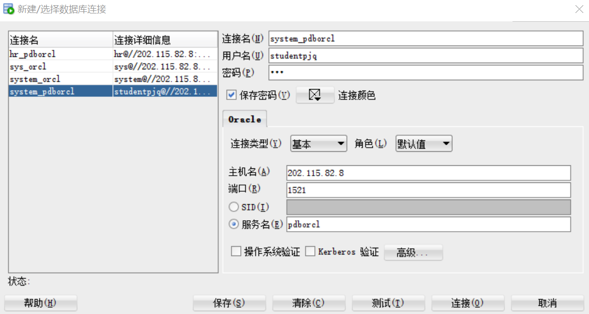

  代码：

  ```sql
  CREATE TABLE ORDERS
    (ORDER_ID NUMBER(10, 0) NOT NULL
    , CUSTOMER_NAME VARCHAR2(40 BYTE) NOT NULL
    , CUSTOMER_TEL VARCHAR2(40 BYTE) NOT NULL
    , ORDER_DATE DATE NOT NULL
    , EMPLOYEE_ID NUMBER(6, 0) NOT NULL
    , DISCOUNT NUMBER(8, 2) DEFAULT 0
    , TRADE_RECEIVABLE NUMBER(8, 2) DEFAULT 0
    , CONSTRAINT ORDERS_PK PRIMARY KEY
      (
        ORDER_ID
      )
      USING INDEX
      (
        CREATE UNIQUE INDEX ORDERS_PK ON ORDERS (ORDER_ID ASC)
      LOGGING
      TABLESPACE USERS
      PCTFREE 10
      INITRANS 2
      STORAGE
      (
        BUFFER_POOL DEFAULT
      )
      NOPARALLEL
      )
      ENABLE
    )
    TABLESPACE USERS
    PCTFREE 10
    INITRANS 1
    STORAGE
    (
      BUFFER_POOL DEFAULT
    )
    NOCOMPRESS
    NOPARALLEL
    PARTITION BY RANGE (ORDER_DATE)
    (
      PARTITION PARTITION_2015 VALUES LESS THAN (TO_DATE    ('2016-01-01 00:00:00', 'SYYYY-MM-DD     HH24:MI:SS',     'NLS_CALENDAR=GREGORIAN'))
      NOLOGGING
      TABLESPACE USERS
      PCTFREE 10
      INITRANS 1
      STORAGE
      (
        INITIAL 8388608
        NEXT 1048576
        MINEXTENTS 1
        MAXEXTENTS UNLIMITED
        BUFFER_POOL DEFAULT
      )
      NOCOMPRESS NO INMEMORY
    , PARTITION PARTITION_2016 VALUES LESS THAN (TO_DATE    ('2017-01-01 00:00:00', 'SYYYY-MM-DD     HH24:MI:SS',     'NLS_CALENDAR=GREGORIAN'))
      NOLOGGING
      TABLESPACE USERS
      PCTFREE 10
      INITRANS 1
      STORAGE
      (
        BUFFER_POOL DEFAULT
      )
      NOCOMPRESS NO INMEMORY
    , PARTITION PARTITION_2017 VALUES LESS THAN (TO_DATE    ('2018-01-01 00:00:00', 'SYYYY-MM-DD     HH24:MI:SS',     'NLS_CALENDAR=GREGORIAN'))
      NOLOGGING
      TABLESPACE USERS
      PCTFREE 10
      INITRANS 1
      STORAGE
      (
        BUFFER_POOL DEFAULT
      )
      NOCOMPRESS NO INMEMORY
    , PARTITION PARTITION_2018 VALUES LESS THAN (TO_DATE    ('2019-01-01 00:00:00', 'SYYYY-MM-DD     HH24:MI:SS',     'NLS_CALENDAR=GREGORIAN'))
      NOLOGGING
      TABLESPACE USERS02
      PCTFREE 10
      INITRANS 1
      STORAGE
      (
        BUFFER_POOL DEFAULT
      )
      NOCOMPRESS NO INMEMORY
    , PARTITION PARTITION_2019 VALUES LESS THAN (TO_DATE    ('2020-01-01 00:00:00', 'SYYYY-MM-DD     HH24:MI:SS',     'NLS_CALENDAR=GREGORIAN'))
      NOLOGGING
      TABLESPACE USERS02
      PCTFREE 10
      INITRANS 1
      STORAGE
      (
        BUFFER_POOL DEFAULT
      )
      NOCOMPRESS NO INMEMORY
    , PARTITION PARTITION_2020 VALUES LESS THAN (TO_DATE    ('2021-01-01 00:00:00', 'SYYYY-MM-DD     HH24:MI:SS',     'NLS_CALENDAR=GREGORIAN'))
      NOLOGGING
      TABLESPACE USERS02
      PCTFREE 10
      INITRANS 1
      STORAGE
      (
        BUFFER_POOL DEFAULT
      )
      NOCOMPRESS NO INMEMORY
    , PARTITION PARTITION_2021 VALUES LESS THAN (TO_DATE    ('2022-01-01 00:00:00', 'SYYYY-MM-DD     HH24:MI:SS',     'NLS_CALENDAR=GREGORIAN'))
      NOLOGGING
      TABLESPACE USERS03
      PCTFREE 10
      INITRANS 1
      STORAGE
      (
        BUFFER_POOL DEFAULT
      )
      NOCOMPRESS NO INMEMORY
       );
  ```
  运行结果：
  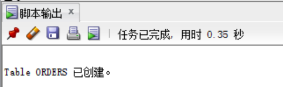


- **第2步：在用户studentpjq中创建表：order_details（订单详情表）**。

  代码：  

  ```sql
  CREATE TABLE order_details
    (
    id NUMBER(10, 0) NOT NULL
    , order_id NUMBER(10, 0) NOT NULL
    , product_name VARCHAR2(40 BYTE) NOT NULL
    , product_num NUMBER(8, 2) NOT NULL
    , product_price NUMBER(8, 2) NOT NULL
    , CONSTRAINT order_details_fk1 FOREIGN KEY  (order_id)
    REFERENCES orders  (  order_id   )
    ENABLE
    )
    TABLESPACE USERS
    PCTFREE 10 INITRANS 1
    STORAGE (BUFFER_POOL DEFAULT )
    NOCOMPRESS NOPARALLEL
    PARTITION BY REFERENCE (order_details_fk1);
  exit;
  ```

  运行结果：
  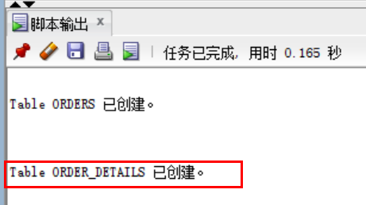
    

- **第3步：用户system连接到system_pdborcl，授权三个表空间表**
  **system登录：**

  
  
  代码:

  ```sql
  ALTER USER studentpjq QUOTA UNLIMITED ON USERS;
  ALTER USER studentpjq QUOTA UNLIMITED ON USERS02;
  ALTER USER studentpjq QUOTA UNLIMITED ON USERS03;
  ```

  运行结果：
  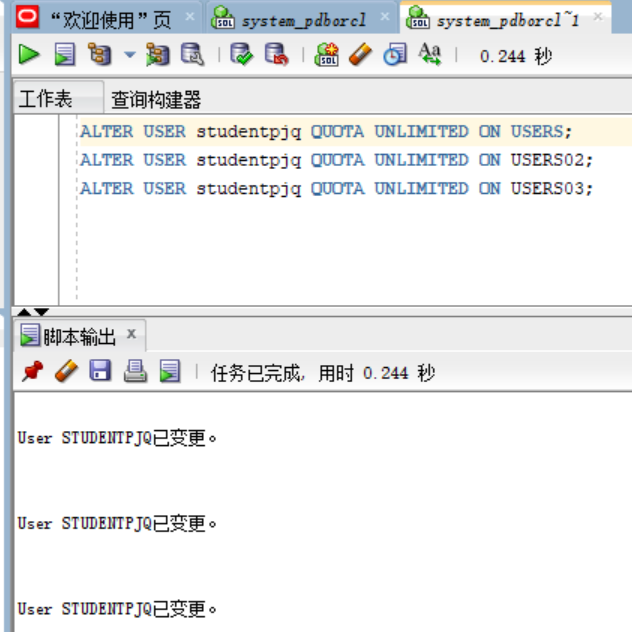

- **第4步：以system用户修改studentpjq用户的权限**
  **system登录：**

  编辑studentpjq用户:
  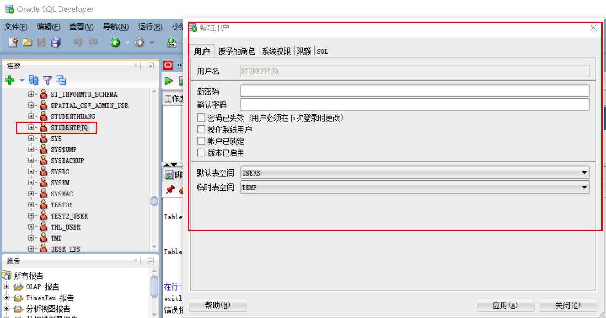

  执行授权操作:
  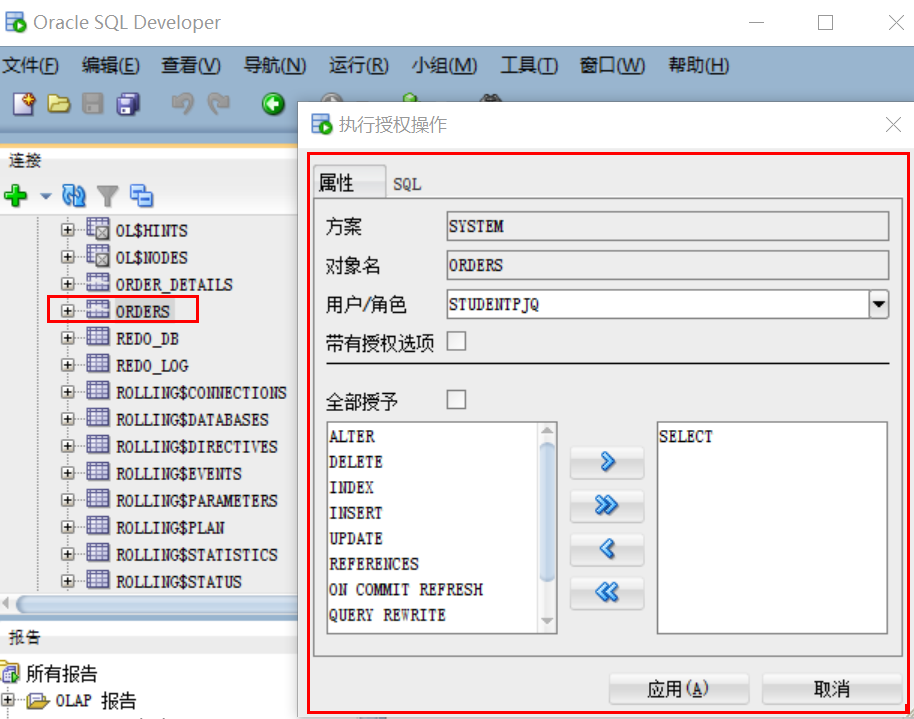
  
  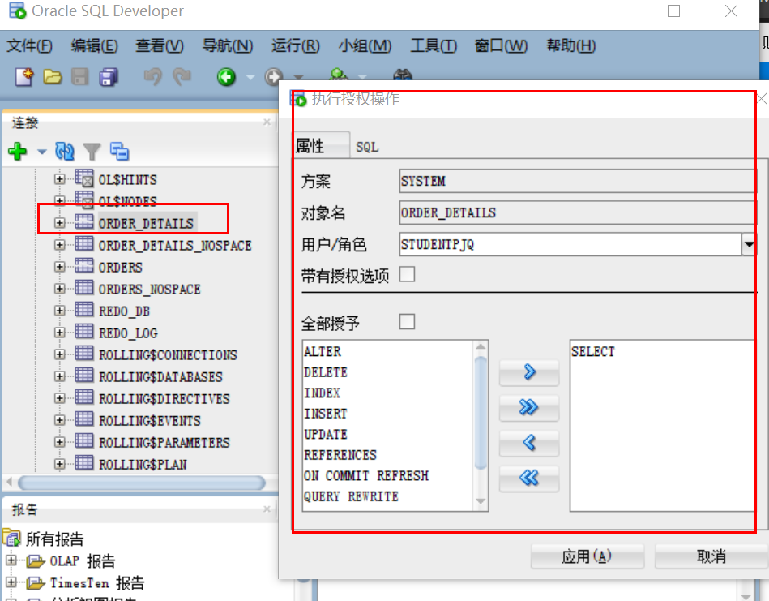
  

- **第5步：对有分区表执行计划分析**
  
  **以system登录：**
  

  **执行计划分析：**

  代码:

  ```sql
  set autotrace on
  select* from studentpjq.orders where order_date
  between to_date ('2017-1-1','yyyy-mm-dd') and to_date('2018-6-1','yyyy-mm-dd');
  ```

  运行结果：
  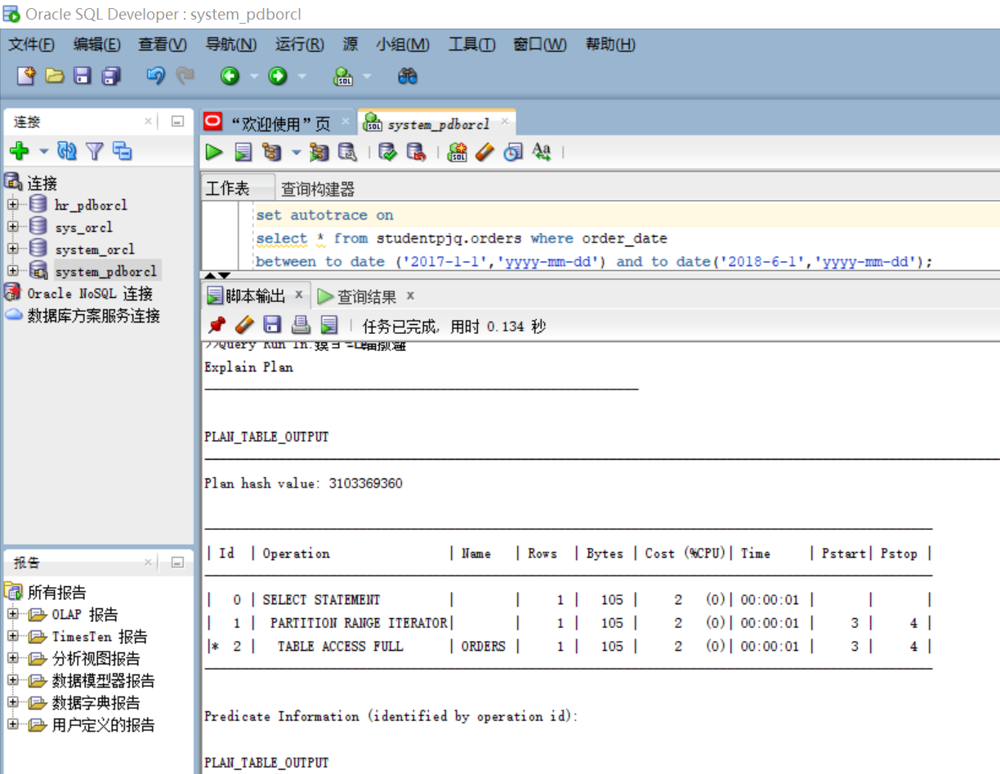
  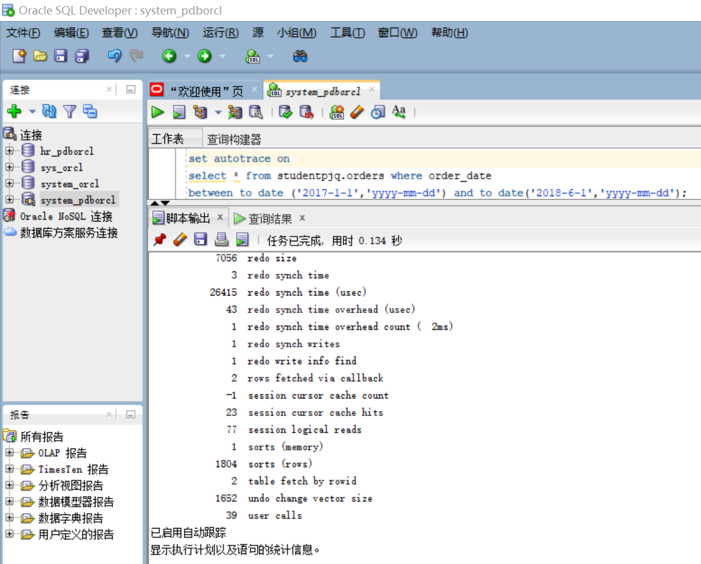

- **第6步：以用户system创建无分区表**
  
  **以system登录：**
  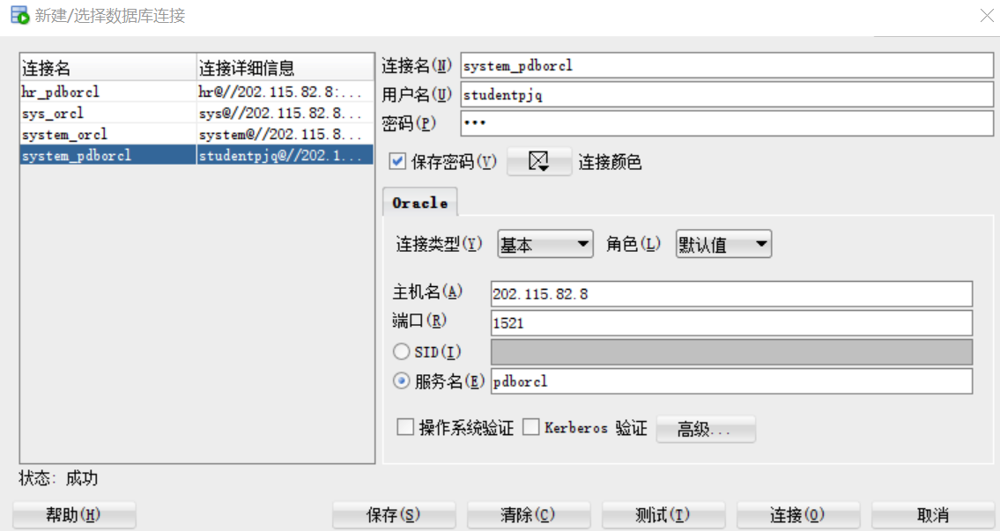

  **执行计划分析：**

  代码:

  ```sql
  CREATE TABLE ORDERS_NOSPACE 
    (
      ORDER_ID NUMBER(10, 0) NOT NULL 
    , CUSTOMER_NAME VARCHAR2(40 BYTE) NOT NULL 
    , CUSTOMER_TEL VARCHAR2(40 BYTE) NOT NULL 
    , ORDER_DATE DATE NOT NULL 
    , EMPLOYEE_ID NUMBER(6, 0) DEFAULT 0 
    , DISCOUNT NUMBER(8, 2) DEFAULT 0 
    , CONSTRAINT ORDERS_ID_ORDERS_DETAILS PRIMARY KEY 
      (
        ORDER_ID 
      )
      USING INDEX 
      (
          CREATE UNIQUE INDEX ORDERS_ID_ORDERS_DETAILS ON     ORDERS_NOSPACE (ORDER_ID ASC) 
          LOGGING 
          TABLESPACE USERS 
          PCTFREE 10 
          INITRANS 2 
          STORAGE 
          ( 
            BUFFER_POOL DEFAULT 
          ) 
          NOPARALLEL 
      )
      ENABLE 
    ) 
    LOGGING 
    TABLESPACE USERS 
    PCTFREE 10 
    INITRANS 1 
    STORAGE 
    ( 
      BUFFER_POOL DEFAULT 
    ) 
    NOCOMPRESS 
    NO INMEMORY 
    NOPARALLEL;
    
    #建立orders_details_nospace表
    CREATE TABLE ORDER_DETAILS_NOSPACE 
    (
      ID NUMBER(10, 0) NOT NULL 
    , ORDER_ID NUMBER(10, 0) NOT NULL 
    , PRODUCT_NAME VARCHAR2(40 BYTE) NOT NULL 
    , PRODUCT_NUM NUMBER(8, 2) NOT NULL 
    , PRODUCT_PRICE NUMBER(8, 2) NOT NULL 
    ) 
    LOGGING 
    TABLESPACE USERS 
    PCTFREE 10 
    INITRANS 1 
    STORAGE 
    ( 
      INITIAL 65536 
      NEXT 1048576 
      MINEXTENTS 1 
      MAXEXTENTS UNLIMITED 
      BUFFER_POOL DEFAULT 
    ) 
    NOCOMPRESS 
    NO INMEMORY 
    NOPARALLEL;
    
    ALTER TABLE ORDER_DETAILS_NOSPACE
    ADD CONSTRAINT ORDERS_FOREIGN_ORDERS_DETAILS FOREIGN KEY
    (
      ORDER_ID 
    )
    REFERENCES ORDERS_NOSPACE
    (
      ORDER_ID 
    )
    ENABLE;
  ```
  
  运行结果：
  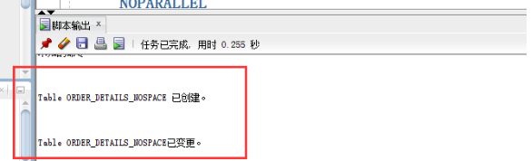

 **第7步：对无分区表执行计划分析**
  代码：
   ```sql
  set autotrace on

  select * from studentpjq.orders where order_date
  between to_date('2017-1-1','yyyy-mm-dd') and to_date('2018-6-1','yyyy-mm-dd');

  select a.ORDER_ID,a.CUSTOMER_NAME,
  b.product_name,b.product_num,b.product_price
  from studentpjq.orders a,studentpjq.order_details b where
  a.ORDER_ID=b.order_id and
  a.order_date between to_date('2017-1-1','yyyy-mm-dd') and to_date('2018-6-1','yyyy-mm-dd');
  ```

  运行结果：
  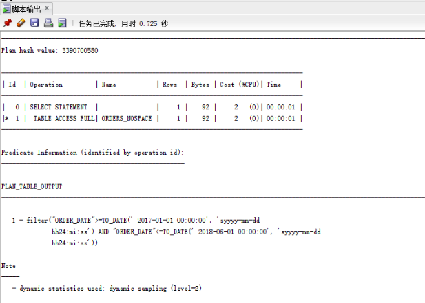
  


## 实验总结

通过本次创建分区表实验我理解了分区表的创建方法，掌握各种分区方式的使用场景。
我明白了如果在分区表里查询数据，同一个分区查找明显比不同分区查找快、在orders数据量为10000,order_details数据量为30000时，有分区比无分区查找数据优势更大，且分区表在数据量大时进行查找的优势比较大，数据小时有无分区的差别不大。
通过一次次实验感受到orders的魅力。