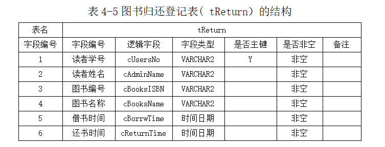
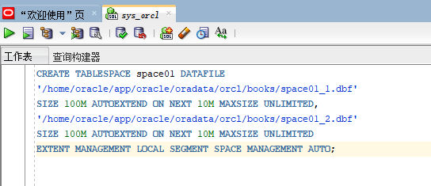

# 实验6：基于Oracle的图书馆读者论坛数据库设计
## 2018软件工程1班 彭嘉绮 201810215310
### 需求分析
### 背景
    图书馆在正常运营中面对大量书籍、读者信息以及两者间相互联系产生的借书信息、还书信息。现有的人工记录方法既效率低又错误过多，大大影响了图书馆的正常管理工作。因此需要对书籍资源、读者资源、借书信息、还书信息进行管理，及时了解各个环节中信息的变更，有利于管理效率的提高。伴随经济的飞速发展，图书馆的数量量不断增加，为加强读者之间的联系，所以便有了各大图书馆读者论坛的诞生，本项目也因此设计了一个基于Oracle 的图书馆读者论坛数据库。
### 总体活动流程图

### 整体描述系统用例

### 数据流程图


### 概念结构设计 
### 分E-R图 
管理员E-R图

学生E-R图

图书E-R图

### 总E-R图 
总E-R图

设计说明:
上图是该图书管理系统总E-R图，该系统涉及的实体集有:
学生实体集:具有属性用户名、密码、学号，姓名，性别，院系、班级、电话
图书实体集:具有属性图书ISBN编号、图书书名、作者、出版社、定价、图书类别管理员实体集:具有属性用户名、密码、姓名、加入时间
一个学生可以借阅和归还多本图书，所以学生和图书之间的联系为1:n的联系。
一个管理员可以对多本图书进行管理，图书管理员可以有多个，
所以管理员和图书之间的联系为m:n的联系。
一个管理员可以对多个读者进行管理，图书管理员可以有多个，
所以管理员和学生之间的联系为m:n的联系。
### 关系模式
将概念模型转换成关系模式
(1)图书实体集可以转换为关系:
tBook(cBooksISBN,cBooksName,cBooksAuthor,cBooksType,cBooksPrice,cBooksPublisher,cBooksStore,cBooksISBN 表示图书编号，cBooksName表示图书名称，cBooksAuthor表示图书作者，cBooksType表示图书类型，cBooksPrice表示图书价格，cBooksPublisher表示图书出版社，CBooksStore表示图书库存量
(2)读者实体集可以转换为关系:
tUser(cUsersID,cUsersPwd,cUsersNo,cUsersName,cUsersSex,cUsersDepartcUsersClass,cUsersTeb,cUsersID表示读者用户名，cUsersPwd表示用户密码，cUsersNo表示读者学号，cUsersName表示读者姓名，cUsersSex表示读者性别，cUsersDepart表示读者院系，cUsersClass表示读者班级，cUsersTel表示读者电话
(3)管理员实体集可以转换为关系:
tAdmin( cAdminID , cAdminPwd ,cAdminName，cAdminAddTime)cAdminID表示管理员用户名，cAdminPwd表示密码，cAdminName表示管理员姓名，cAdminAddTime表示管理员加入时间。
(4)因为学生和图书之间的联系为1: n的联系，所以tUser (cUsersID，cBookslSBN)
cBooksISBN表示学生借阅的图书。
(5)因为管理员和图书之间的联系为m: n的联系，以:tAdmin(cAdminID,cBooksISBN)
cBooksISBN表示管理员管理的图书。
(6)因为管理员和学生之间的联系为m: n的联系，所以:tAdmin(cAdminID ,cUsersID)cUsersID表示管理员管理的学生。
### 物理结构设计
依据关系模式，并结合以上E-R图，经过转化，即可进行数据库的物理设计。该系统的数据库采用Oracle，基于以上数据库的逻辑设计，本系统决定采用一个数据库，在其下创建5个数据表，其结构分别如下:
### 管理员信息表
表4-1管理员信息表( tAdmin）的结构

### 读者信息表
表4-2读者信息表( tUser）的结构

### 图书馆信息表
表4-3图书馆信息表( tBook）的结构

### 图书借阅登记表
表4-4图书借阅登记表( tBorrow）的结构

### 图书归还登记表
表4-5图书归还登记表( tReturn）的结构

### 数据库实施代码
### 创建数据库并创建数据表
建管理员表 
  代码：
  ```sql
  create table tAdmin 
  (cAdminID char(6) primary key, 
  cAdminPwd char(6) not null, 
  cAdminName char(10) not null,
  cAsminSex char(2), 
  cAdminAddTime char(10));
  ```
  运行结果：
  

创建space01表
  代码：
  ```sql
  CREATE TABLESPACE space01 DATAFILE
  '/home/oracle/app/oracle/oradata/orcl/books/space01_1.dbf'
  SIZE 100M AUTOEXTEND ON NEXT 10M MAXSIZE UNLIMITED,
  '/home/oracle/app/oracle/oradata/orcl/books/space01_2.dbf'
  SIZE 100M AUTOEXTEND ON NEXT 10M MAXSIZE UNLIMITED
  EXTENT MANAGEMENT LOCAL SEGMENT SPACE MANAGEMENT AUTO;
  ```
  运行结果：
  

创建表空间sapce02
  代码：
  ```sql
  CREATE TABLESPACE space02 DATAFILE
  '/home/oracle/app/oracle/oradata/orcl/books/space02_1.dbf'
  SIZE 100M AUTOEXTEND ON NEXT 10M MAXSIZE UNLIMITED,
  '/home/oracle/app/oracle/oradata/orcl/books/space02_2.dbf'
  SIZE 100M AUTOEXTEND ON NEXT 10M MAXSIZE UNLIMITED
  EXTENT MANAGEMENT LOCAL SEGMENT SPACE MANAGEMENT AUTO;
  ```
  运行结果：
  

创建管理员角色
  代码：
  ```sql
  CREATE ROLE admins;
  GRANT create any table, alter any table,  create tablespace, alter tablespace,   create user, alter user,
  create any procedure, alter any procedure,  create session, alter session
  to admins with admin option;
  ```
  运行结果：
  

创建用户角色
  代码：
  ```sql
 CREATE ROLE users;
  GRANT create session to users with admin  option;
  ```
  运行结果：
  

创建管理员用户
创建管理员用户admin_01,并赋予它所有权限
  代码：
  ```sql
 GRANT "DBA" TO "admin_01" WITH admin_01 OPTION;  
  GRANT "C##CON_RES" TO "admin_01" WITH admin _01 OPTION;  
  GRANT "DV_MONITOR" TO "admin_01" WITH admin _01 OPTION;  
  GRANT "CTXAPP" TO "admin_01" WITH admin_01  OPTION;  
  GRANT "DV_AUDIT_CLEANUP" TO "admin_01" WITH  admin_01 OPTION;  
  GRANT "SPATIAL_CSW_admin_01" TO "admin_01"  WITH admin_01 OPTION;  
  GRANT "APEX_GRANTS_FOR_NEW_USERS_ROLE" TO " admin_01" WITH admin_01 OPTION;  
  GRANT "WFS_USR_ROLE" TO "admin_01" WITH adm in_01 OPTION;  
  GRANT "EM_EXPRESS_ALL" TO "admin_01" WITH a dmin_01 OPTION;  
  GRANT "WM_admin_01_ROLE" TO "admin_01" WITH  admin_01 OPTION;  
  GRANT "OLAP_USER" TO "admin_01" WITH admin_ 01 OPTION;  
  GRANT "OLAP_XS_admin_01" TO "admin_01" WITH  admin_01 OPTION;  
  GRANT "DV_SECANALYST" TO "admin_01" WITH ad min_01 OPTION;  
  GRANT "CSW_USR_ROLE" TO "admin_01" WITH adm in_01 OPTION;  
  GRANT "XS_CACHE_admin_01" TO "admin_01" WIT H admin_01 OPTION;  
  GRANT "GDS_CATALOG_SELECT" TO "admin_01" WI TH admin_01 OPTION;  
  GRANT "SCHEDULER_admin_01" TO "admin_01" WI TH admin_01 OPTION;  
  GRANT "PROVISIONER" TO "admin_01" WITH admi n_01 OPTION;  
  GRANT "AUDIT_admin_01" TO "admin_01" WITH a dmin_01 OPTION;  
  GRANT "XDB_WEBSERVICES_OVER_HTTP" TO "admin _01" WITH admin_01 OPTION;  
  GRANT "DV_REALM_RESOURCE" TO "admin_01" WIT H admin_01 OPTION;  
  GRANT "AQ_admin_01ISTRATOR_ROLE" TO "admin_ 01" WITH admin_01 OPTION;  
  GRANT "DELETE_CATALOG_ROLE" TO "admin_01" W ITH admin_01 OPTION;  
  GRANT "CON_RES" TO "admin_01" WITH admin_01  OPTION;  
  GRANT "XDB_WEBSERVICES" TO "admin_01" WITH  admin_01 OPTION;  
  GRANT "DV_PUBLIC" TO "admin_01" WITH admin_ 01 OPTION;  
  GRANT "LBAC_DBA" TO "admin_01" WITH admin_0 1 OPTION;  
  GRANT "OPTIMIZER_PROCESSING_RATE" TO "admin _01" WITH admin_01 OPTION;  
  GRANT "RECOVERY_CATALOG_USER" TO "admin_01"  WITH admin_01 OPTION;  
  GRANT "DV_DATAPUMP_NETWORK_LINK" TO "admin_ 01" WITH admin_01 OPTION;  
  GRANT "GSMUSER_ROLE" TO "admin_01" WITH adm in_01 OPTION;  
  GRANT "GATHER_SYSTEM_STATISTICS" TO "admin_ 01" WITH admin_01 OPTION;  
  GRANT "LOGSTDBY_admin_01ISTRATOR" TO "admin _01" WITH admin_01 OPTION;  
  GRANT "GSM_POOLadmin_01_ROLE" TO "admin_01"  WITH admin_01 OPTION;  
  GRANT "DV_admin_01" TO "admin_01" WITH admi n_01 OPTION;  
  GRANT "HS_admin_01_ROLE" TO "admin_01" WITH  admin_01 OPTION;  
  GRANT "XS_SESSION_admin_01" TO "admin_01" W ITH admin_01 OPTION;  
  GRANT "DV_GOLDENGATE_admin_01" TO "admin_01 " WITH admin_01 OPTION;  
  GRANT "IMP_FULL_DATABASE" TO "admin_01" WIT H admin_01 OPTION;  
  GRANT "DV_XSTREAM_admin_01" TO "admin_01" W ITH admin_01 OPTION;  
  GRANT "DV_PATCH_admin_01" TO "admin_01" WIT H admin_01 OPTION;  
  GRANT "DATAPUMP_EXP_FULL_DATABASE" TO "admi n_01" WITH admin_01 OPTION;  
  GRANT "EJBCLIENT" TO "admin_01" WITH admin_ 01 OPTION;  
  GRANT "HS_admin_01_EXECUTE_ROLE" TO "admin_ 01" WITH admin_01 OPTION;  
  GRANT "JMXSERVER" TO "admin_01" WITH admin_ 01 OPTION;  
  GRANT "OLAP_DBA" TO "admin_01" WITH admin_0 1 OPTION;  
  GRANT "ADM_PARALLEL_EXECUTE_TASK" TO "admin _01" WITH admin_01 OPTION;  
  GRANT "JAVAIDPRIV" TO "admin_01" WITH admin _01 OPTION;  
  GRANT "SELECT_CATALOG_ROLE" TO "admin_01" W ITH admin_01 OPTION;  
  GRANT "JAVADEBUGPRIV" TO "admin_01" WITH ad min_01 OPTION;  
  GRANT "CONNECT" TO "admin_01" WITH admin_01  OPTION;  
  GRANT "DATAPUMP_IMP_FULL_DATABASE" TO "admi n_01" WITH admin_01 OPTION;  
  GRANT "OEM_MONITOR" TO "admin_01" WITH admi n_01 OPTION;  
  GRANT "APEX_admin_01ISTRATOR_ROLE" TO "admi n_01" WITH admin_01 OPTION;  
  GRANT "GSMadmin_01_ROLE" TO "admin_01" WITH  admin_01 OPTION;  
  GRANT "AQ_USER_ROLE" TO "admin_01" WITH adm in_01 OPTION;  
  GRANT "JAVAUSERPRIV" TO "admin_01" WITH adm in_01 OPTION;  
  GRANT "XDB_SET_INVOKER" TO "admin_01" WITH  admin_01 OPTION;  
  GRANT "RECOVERY_CATALOG_OWNER" TO "admin_01 " WITH admin_01 OPTION;  
  GRANT "JAVA_admin_01" TO "admin_01" WITH ad min_01 OPTION;  
  GRANT "DBFS_ROLE" TO "admin_01" WITH admin_ 01 OPTION;  
  GRANT "PDB_DBA" TO "admin_01" WITH admin_01  OPTION;  
  GRANT "DV_GOLDENGATE_REDO_ACCESS" TO "admin _01" WITH admin_01 OPTION;  
  GRANT "CDB_DBA" TO "admin_01" WITH admin_01  OPTION;  
  GRANT "JAVASYSPRIV" TO "admin_01" WITH admi n_01 OPTION;  
  GRANT "HS_admin_01_SELECT_ROLE" TO "admin_0 1" WITH admin_01 OPTION;  
  GRANT "AUDIT_VIEWER" TO "admin_01" WITH adm in_01 OPTION;  
  GRANT "RESOURCE" TO "admin_01" WITH admin_0 1 OPTION;  
  GRANT "DV_OWNER" TO "admin_01" WITH admin_0 1 OPTION;  
  GRANT "XDB_WEBSERVICES_WITH_PUBLIC" TO "adm in_01" WITH admin_01 OPTION;  
  GRANT "EXECUTE_CATALOG_ROLE" TO "admin_01"  WITH admin_01 OPTION;  
  GRANT "DV_ACCTMGR" TO "admin_01" WITH admin _01 OPTION;  
  GRANT "DV_REALM_OWNER" TO "admin_01" WITH a dmin_01 OPTION;  
  GRANT "EXP_FULL_DATABASE" TO "admin_01" WIT H admin_01 OPTION;  
  GRANT "DV_STREAMS_admin_01" TO "admin_01" W ITH admin_01 OPTION;  
  GRANT "JAVA_DEPLOY" TO "admin_01" WITH admi n_01 OPTION;  
  GRANT "SPATIAL_WFS_admin_01" TO "admin_01"  WITH admin_01 OPTION;  
  GRANT "XS_NAMESPACE_admin_01" TO "admin_01"  WITH admin_01 OPTION;  
  GRANT "DEV" TO "admin_01" WITH admin_01 OPT ION;  
  GRANT "XS_RESOURCE" TO "admin_01" WITH admi n_01 OPTION;  
  GRANT "ORDadmin_01" TO "admin_01" WITH admi n_01 OPTION;  
  GRANT "AUTHENTICATEDUSER" TO "admin_01" WIT H admin_01 OPTION;  
  GRANT "CAPTURE_admin_01" TO "admin_01" WITH  admin_01 OPTION;  
  GRANT "OEM_ADVISOR" TO "admin_01" WITH admi n_01 OPTION;  
  GRANT "XDBadmin_01" TO "admin_01" WITH admi n_01 OPTION;  
  ```
  运行结果：
  


创建普通用户的用户
  代码：
  ```sql
  CREATE USER user_02 IDENTIFIED by 123;
  GRANT users to user_02;
  ```
  运行结果：
  

### 创建表及插入数据
板块表
  代码：
  ```sql
 DROP TABLE Bankuai;
CREATE TABLE Bankuai (
  "name" VARCHAR2(255 BYTE) VISIBLE NOT NULL ,
  "introduction" VARCHAR2(255 BYTE) VISIBLE NOT NULL 
)
TABLESPACE "SPACE01"
LOGGING
NOCOMPRESS
PCTFREE 10
INITRANS 1
STORAGE (
  BUFFER_POOL DEFAULT
)
PARALLEL 1
NOCACHE
DISABLE ROW MOVEMENT
;
COMMENT ON COLUMN Bankuai."name" IS '板块名';
COMMENT ON COLUMN Bankuai."introduction" IS '板块的描述';

ALTER TABLE Bankuai ADD CONSTRAINT "SYS_C0038651" PRIMARY KEY ("name");

-- ----------------------------
-- Checks structure for table Bankuai
-- ----------------------------
ALTER TABLE Bankuai ADD CONSTRAINT "SYS_C0038649" CHECK ("name" IS NOT NULL) NOT DEFERRABLE INITIALLY IMMEDIATE NORELY VALIDATE;
ALTER TABLE Bankuai ADD CONSTRAINT "SYS_C0038650" CHECK ("introduction" IS NOT NULL) NOT DEFERRABLE INITIALLY IMMEDIATE NORELY VALIDATE;
  ```
  表结构：
  
  插入数据，运行结果：
  
  
话题表
  代码：
  ```sql
 DROP TABLE post;
CREATE TABLE post (
  "id" NUMBER VISIBLE NOT NULL ,
  "name" VARCHAR2(255 BYTE) VISIBLE NOT NULL ,
  "user_id" NUMBER VISIBLE NOT NULL ,
  "title" VARCHAR2(255 BYTE) VISIBLE NOT NULL ,
  "details" VARCHAR2(255 BYTE) VISIBLE NOT NULL ,
  "time" DATE VISIBLE NOT NULL 
)
TABLESPACE "SPACE01"
LOGGING
NOCOMPRESS
PCTFREE 10
INITRANS 1
STORAGE (
  BUFFER_POOL DEFAULT
)
PARALLEL 1
NOCACHE
DISABLE ROW MOVEMENT
;
COMMENT ON COLUMN post."id" IS '话题id';
COMMENT ON COLUMN post."name" IS '所属板块名';
COMMENT ON COLUMN post."user_id" IS '发帖人id';
COMMENT ON COLUMN post."title" IS '话题标题';
COMMENT ON COLUMN post."details" IS '话题细节';
COMMENT ON COLUMN post."time" IS '提起时间';

ALTER TABLE post ADD CONSTRAINT "SYS_C0038667" PRIMARY KEY ("id");

-- ----------------------------
-- Checks structure for table post
-- ----------------------------
ALTER TABLE post ADD CONSTRAINT "SYS_C0038661" CHECK ("id" IS NOT NULL) NOT DEFERRABLE INITIALLY IMMEDIATE NORELY VALIDATE;
ALTER TABLE post ADD CONSTRAINT "SYS_C0038662" CHECK ("name" IS NOT NULL) NOT DEFERRABLE INITIALLY IMMEDIATE NORELY VALIDATE;
ALTER TABLE post ADD CONSTRAINT "SYS_C0038663" CHECK ("user_id" IS NOT NULL) NOT DEFERRABLE INITIALLY IMMEDIATE NORELY VALIDATE;
ALTER TABLE post ADD CONSTRAINT "SYS_C0038664" CHECK ("title" IS NOT NULL) NOT DEFERRABLE INITIALLY IMMEDIATE NORELY VALIDATE;
ALTER TABLE post ADD CONSTRAINT "SYS_C0038665" CHECK ("details" IS NOT NULL) NOT DEFERRABLE INITIALLY IMMEDIATE NORELY VALIDATE;
ALTER TABLE post ADD CONSTRAINT "SYS_C0038666" CHECK ("time" IS NOT NULL) NOT DEFERRABLE INITIALLY IMMEDIATE NORELY VALIDATE;
  ```
  表结构：
  
  插入数据，运行结果：
  

回复表1
  代码：
  ```sql
 DROP TABLE reply_one;
CREATE TABLE reply_one (
  "id" NUMBER VISIBLE NOT NULL ,
  "post_id" NUMBER VISIBLE NOT NULL ,
  "user_id" NUMBER VISIBLE NOT NULL ,
  "details" VARCHAR2(255 BYTE) VISIBLE NOT NULL ,
  "time" DATE VISIBLE NOT NULL 
)
TABLESPACE "SPACE01"
LOGGING
NOCOMPRESS
PCTFREE 10
INITRANS 1
STORAGE (
  BUFFER_POOL DEFAULT
)
PARALLEL 1
NOCACHE
DISABLE ROW MOVEMENT
;
COMMENT ON COLUMN reply_one."id" IS '回复id';
COMMENT ON COLUMN reply_one."post_id" IS '话题id';
COMMENT ON COLUMN reply_one."user_id" IS '回复用户id';
COMMENT ON COLUMN reply_one."details" IS '回复内容';
COMMENT ON COLUMN reply_one."time" IS '回复时间';

ALTER TABLE reply_one ADD CONSTRAINT "SYS_C0038673" PRIMARY KEY ("id", "post_id");

-- ----------------------------
-- Checks structure for table reply_one
-- ----------------------------
ALTER TABLE reply_one ADD CONSTRAINT "SYS_C0038668" CHECK ("id" IS NOT NULL) NOT DEFERRABLE INITIALLY IMMEDIATE NORELY VALIDATE;
ALTER TABLE reply_one ADD CONSTRAINT "SYS_C0038669" CHECK ("post_id" IS NOT NULL) NOT DEFERRABLE INITIALLY IMMEDIATE NORELY VALIDATE;
ALTER TABLE reply_one ADD CONSTRAINT "SYS_C0038670" CHECK ("user_id" IS NOT NULL) NOT DEFERRABLE INITIALLY IMMEDIATE NORELY VALIDATE;
ALTER TABLE reply_one ADD CONSTRAINT "SYS_C0038671" CHECK ("details" IS NOT NULL) NOT DEFERRABLE INITIALLY IMMEDIATE NORELY VALIDATE;
ALTER TABLE reply_one ADD CONSTRAINT "SYS_C0038672" CHECK ("time" IS NOT NULL) NOT DEFERRABLE INITIALLY IMMEDIATE NORELY VALIDATE;
  ```
  表结构：
  
  插入数据，运行结果：
  

回复表2
  代码：
  ```sql
 DROP TABLE reply_two;
CREATE TABLE reply_two (
  "id" NUMBER VISIBLE NOT NULL ,
  "post_id" NUMBER VISIBLE NOT NULL ,
  "reply_id" NUMBER VISIBLE NOT NULL ,
  "user_id" NUMBER VISIBLE NOT NULL ,
  "details" VARCHAR2(255 BYTE) VISIBLE NOT NULL ,
  "time" DATE VISIBLE NOT NULL 
)
TABLESPACE "SPACE01"
LOGGING
NOCOMPRESS
PCTFREE 10
INITRANS 1
STORAGE (
  BUFFER_POOL DEFAULT
)
PARALLEL 1
NOCACHE
DISABLE ROW MOVEMENT
;
COMMENT ON COLUMN reply_two."id" IS '再次回复的id';
COMMENT ON COLUMN reply_two."post_id" IS '话题id';
COMMENT ON COLUMN reply_two."reply_id" IS '回复的id';
COMMENT ON COLUMN reply_two."user_id" IS '用户id';
COMMENT ON COLUMN reply_two."details" IS '回复内容';
COMMENT ON COLUMN reply_two."time" IS '回复时间';

ALTER TABLE reply_two ADD CONSTRAINT "SYS_C0038680" PRIMARY KEY ("id", "post_id", "reply_id");

-- ----------------------------
-- Checks structure for table reply_two
-- ----------------------------
ALTER TABLE reply_two ADD CONSTRAINT "SYS_C0038674" CHECK ("id" IS NOT NULL) NOT DEFERRABLE INITIALLY IMMEDIATE NORELY VALIDATE;
ALTER TABLE reply_two ADD CONSTRAINT "SYS_C0038675" CHECK ("post_id" IS NOT NULL) NOT DEFERRABLE INITIALLY IMMEDIATE NORELY VALIDATE;
ALTER TABLE reply_two ADD CONSTRAINT "SYS_C0038676" CHECK ("reply_id" IS NOT NULL) NOT DEFERRABLE INITIALLY IMMEDIATE NORELY VALIDATE;
ALTER TABLE reply_two ADD CONSTRAINT "SYS_C0038677" CHECK ("user_id" IS NOT NULL) NOT DEFERRABLE INITIALLY IMMEDIATE NORELY VALIDATE;
ALTER TABLE reply_two ADD CONSTRAINT "SYS_C0038678" CHECK ("details" IS NOT NULL) NOT DEFERRABLE INITIALLY IMMEDIATE NORELY VALIDATE;
ALTER TABLE reply_two ADD CONSTRAINT "SYS_C0038679" CHECK ("time" IS NOT NULL) NOT DEFERRABLE INITIALLY IMMEDIATE NORELY VALIDATE;
  ```
  表结构：
  
  插入数据，运行结果：
  

用户表
  代码：
  ```sql
 DROP TABLE user_table;
CREATE TABLE user_table (
  "id" NUMBER VISIBLE NOT NULL ,
  "user_name" VARCHAR2(255 BYTE) VISIBLE NOT NULL ,
  "sex" VARCHAR2(255 BYTE) VISIBLE 
)
TABLESPACE "SPACE01"
LOGGING
NOCOMPRESS
PCTFREE 10
INITRANS 1
STORAGE (
  BUFFER_POOL DEFAULT
)
PARALLEL 1
NOCACHE
DISABLE ROW MOVEMENT
;
COMMENT ON COLUMN user_table."id" IS '用户id';
COMMENT ON COLUMN user_table."user_name" IS '用户名';
COMMENT ON COLUMN user_table."sex" IS '用户性别';

ALTER TABLE user_table ADD CONSTRAINT "SYS_C0038687" PRIMARY KEY ("id");

-- ----------------------------
-- Checks structure for table user_table
-- ----------------------------
ALTER TABLE user_table ADD CONSTRAINT "SYS_C0038685" CHECK ("id" IS NOT NULL) NOT DEFERRABLE INITIALLY IMMEDIATE NORELY VALIDATE;
ALTER TABLE user_table ADD CONSTRAINT "SYS_C0038686" CHECK ("user_name" IS NOT NULL) NOT DEFERRABLE INITIALLY IMMEDIATE NORELY VALIDATE;
  ```
  表结构：
  
  插入数据，运行结果：
  
### PL/SQL语言设计存储过程和函数
  函数
   ```sql
 create or replace PACKAGE MyPack IS
  --获取一个用户的发起的话题、回复、再回复总数
  FUNCTION get_posts_num_of_users(user_id int) RETURN int;
  --按照结构显示一个话题
  PROCEDURE show_post(post_id int);
  END MyPack;
  ```
  运行结果：
  
  存储过程
   ```sql
 create or replace PACKAGE BODY MyPack IS
  FUNCTION get_posts_num_of_users(user_id int) RETURN int
  AS
    posts int;
    reply_one int;
    reply_two int;
    begin
      select count(*) into posts from post where "user_id" = user_id;
      select count(*) into reply_one from post where "user_id" = user_id;
      select count(*) into reply_two from post where "user_id" = user_id;
      return posts+reply_one+reply_two;
    end;
  PROCEDURE show_post(post_id int)
  AS
    temp varchar2(255);
    leftspace varchar2(255);
    begin
      leftspace:='   ';
      select "title" into temp from post where "id"=post_id;
      DBMS_OUTPUT.PUT_LINE('标题：'||temp);
      select "details" into temp from post where "id"=post_id;
      DBMS_OUTPUT.PUT_LINE('细节：'||temp);
      for v in (select * from reply_one where "post_id"=post_id)
      loop
        DBMS_OUTPUT.PUT_LINE(leftspace||'用户'||v."user_id"||'回复：'||v."details");
      end loop;
    END;
END MyPack;
  ```
   运行结果：
  
### 备份方案
 数据库备份采取每月一次进行数据库全备份，并且在每日凌晨十二点自动开始增量备份的方式进行备份。
 ### 开始全备份
  [oracle@oracle-pc ~]$ cat rman_level0.sh
  [oracle@oracle-pc ~]$ ./rman_level0.sh
  每天定时开始增量备份
  [oracle@oracle-pc ~]$ cat rman_level1.sh
  [oracle@oracle-pc ~]$ ./rman_level1.sh
  查看备份文件
  *.log是日志文件
  dblv0*.bak是数据库的备份文件
  arclv0*.bak是归档日期的备份文件
  c-1392946895-20210610-01是控制文件和参数的 备份
  [oracle@oracle-pc ~]$ cd rman_backup
  [oracle@oracle-pc rman_backup]$ ls
  arclv0_ORCL_20210610_dauhb2fm_1_1.bak
  c-1392946895-20210610-01
  dblv0_ORCL_20210610_d7uhb2ap_1_1.bak
  dblv0_ORCL_20210610_d8uhb2c6_1_1.bak
  dblv0_ORCL_20210610_d9uhb2ei_1_1.bak
  lv0_20210610-083949_L0.log
  
  查看备份文件的内容
  [oracle@oracle-pc ~]$ rman target /

  RMAN> list backup;
  List of Backup Sets
  ===================
  BS Key  Type LV Size       Device Type  Elapsed Time Completion Time
  ------- ---- -- ---------- -----------  ------------ ---------------275     Incr   0  215.21M    DISK        00:00:36      21-06月-10    
        BP Key: 275   Status: AVAILABLE  Compressed: YES  Tag: TAG20210610T083953
        Piece Name: /home/oracle/rman_backup/dblv0_ORCL_20210610_d7uhb2ap_1_1.bak
  List of Datafiles in backup set 275
  Container ID: 3, PDB Name: PDBORCL
  File LV Type Ckp SCN    Ckp Time   Name
  ---- -- ---- ---------- ---------- ----
  8    0  Incr 48162290   21-06月-10 /home/oracle/app/oracle/oradata/orcl/cars/system01.dbf
  9    0  Incr 48162290   21-06月-10 /home/oracle/app/oracle/oradata/orcl/cars/sysaux01.dbf
  10   0  Incr 48162290   21-06月-10 /home/oracle/app/oracle/oradata/orcl/cars/SAMPLE_SCHEMA_users01.dbf
  11   0  Incr 48162290   21-06月-10 /home/oracle/app/oracle/oradata/orcl/cars/example01.dbf
  12   0  Incr 48162290   21-06月-10 /home/oracle/app/oracle/oradata/orcl/cars/space01_1.dbf
  13   0  Incr 48162290   21-06月-10 /home/oracle/app/oracle/oradata/orcl/cars/space01_2.dbf
  16   0  Incr 48162290   21-06月-10 /home/oracle/app/oracle/oradata/orcl/cars/space01_3.dbf
  17   0  Incr 48162290   21-06月-10 /home/oracle/app/oracle/oradata/orcl/cars/space01_4.dbf
  77   0  Incr 48162290   21-06月-10 /home/oracle/app/oracle/oradata/orcl/cars/space02_1.dbf
  78   0  Incr 48162290   21-06月-10 /home/oracle/app/oracle/oradata/orcl/cars/space02_2.dbf

  BS Key  Type LV Size       Device Type  Elapsed Time Completion Time
  ------- ---- -- ---------- -----------  ------------ ---------------276     Incr   0  368.46M    DISK        00:01:12      21-06月-10    
        BP Key: 276   Status: AVAILABLE  Compressed: YES  Tag: TAG20210610T083953
        Piece Name: /home/oracle/rman_backup/dblv0_ORCL_20210610_d8uhb2c6_1_1.bak
  List of Datafiles in backup set 276
  File LV Type Ckp SCN    Ckp Time   Name
  ---- -- ---- ---------- ---------- ----
  1    0  Incr 48162395   21-06月-10 /home/oracle/app/oracle/oradata/orcl/system01.dbf
  3    0  Incr 48162395   21-06月-10 /home/oracle/app/oracle/oradata/orcl/sysaux01.dbf
  4    0  Incr 48162395   21-06月-10 /home/oracle/app/oracle/oradata/orcl/undotbs01.dbf
  6    0  Incr 48162395   21-06月-10 /home/oracle/app/oracle/oradata/orcl/users01.dbf

  BS Key  Type LV Size       Device Type  Elapsed Time Completion Time
  ------- ---- -- ---------- -----------  ------------ ---------------277     Incr   0  157.08M    DISK        00:00:26     21-06月-10    
        BP Key: 277   Status: AVAILABLE  Compressed: YES  Tag: TAG20210610T083953
        Piece Name: /home/oracle/rman_backup/dblv0_ORCL_20210610_d9uhb2ei_1_1.bak
  List of Datafiles in backup set 277
  Container ID: 2, PDB Name: PDB$SEED
  File LV Type Ckp SCN    Ckp Time   Name
  ---- -- ---- ---------- ---------- ----
  5    0  Incr 1819408    01-12月-14 /home/oracle/app/oracle/oradata/orcl/pdbseed/system01.dbf
  7    0  Incr 1819408    01-12月-14 /home/oracle/app/oracle/oradata/orcl/pdbseed/sysaux01.dbf

  BS Key  Size       Device Type Elapsed  Time Completion Time
  ------- ---------- -----------  ------------ ---------------278     103. 50K    DISK        00:00:00     21-06月  -10    
        BP Key: 278   Status: AVAILABLE  Compressed: YES  Tag: TAG20210610T084230
        Piece Name: /home/oracle/rman_backup/arclv0_ORCL_20210610_dauhb2fm_1_1.bak

  List of Archived Logs in backup set 278
  Thrd Seq     Low SCN    Low Time   Next SCN   Next Time
  ---- ------- ---------- ---------- ---------- ---------
  1    1679    48162279   21-06月-10 48162608   21-06月-10

  S Key  Type LV Size       Device Type  lapsed Time Completion Time
  ------ ---- -- ---------- -----------  ----------- ---------------279      ull    17.77M     DISK          0:00:01     21-06月-10    
        BP Key: 279   Status: AVAILABLE  Compressed: NO  Tag: TAG20210610T084231
        Piece Name: /home/oracle/rman_backup/c-1392946895-20210610-01
  SPFILE Included: Modification time: 21-06月-10
  SPFILE db_unique_name: ORCL
  Control File Included: Ckp SCN: 48162622     Ckp time: 21-06月-10
  由上面的"list backup;" 输出可以看出，备份集中 的文件内容是：
  /home/oracle/rman_backup/  dblv0_ORCL_20210610_d7uhb2ap_1_1.bak 是插接 数据库PDBORCL的备份集
  /home/oracle/rman_backup/  dblv0_ORCL_20210610_d8uhb2c6_1_1.bak 是ORCL 的备份集
  /home/oracle/rman_backup/  dblv0_ORCL_20210610_d9uhb2ei_1_1.bak是  PDB$SEED的备份集
  /home/oracle/rman_backup/  arclv0_ORCL_20210610_dauhb2fm_1_1.bak是归档 文件的备份集
  /home/oracle/rman_backup/  c-1392946895-20210610-01是参数文件(SPFILE)和  控制文件(Control File)的备份集

### 备份后修改数据
 [oracle@oracle-pc ~]$ sqlplus study/123@pdborcl
  SQL> create table t1 (id number,name  varchar2(50));
  Table created.
  SQL> insert into t1 values(1,'zhang');1   row created.
  SQL> commit;
  Commit complete.
  SQL> select * from t1;

          ID NAME
  ----------  -------------------------------------------  -------
           1 zhang
  SQL> exit

### 删除数据库文件，模拟数据库文件损坏
  [oracle@oracle-pc ~]$ rm /home/oracle/app/oracle/oradata/orcl/cars/SAMPLE_SCHEMA_users01.dbf
  删除数据库文件后修改数据
  删除数据文件后，仍然可以增加一条数据。这是因为  增加的数据并没有写入数据文件，而是写到了日志文  件中。如果增加的数据较多的时候，就会出问题了。
  [oracle@oracle-pc ~]$ sqlplus study/  123@pdborcl
  SQL> insert into t1 values(2,'wang');1 row  created.
  SQL> commit;
  Commit complete.
  SQL> select * from t1;
          ID NAME
  ----------  -------------------------------------------  -------
         1 zhang
         2 wang
  SQL> 

  SQL> declare
  2  n number;
  3  begin
  4    for n in 1..10000 loop
  5      insert into t1 values(n,'name'||n);
  6    end loop;
  7  end;
  8  /
  declare
  *
  ERROR at line 1:
  ORA-01116: 打开数据库文件 10 时出错   ORA-01110:
  数据文件 10: '/home/oracle/app/oracle/  oradata/orcl/cars/SAMPLE_SCHEMA_users01.  dbf'
  ORA-27041: 无法打开文件
  Linux-x86_64 Error: 2: No such file or  directory
  Additional information: 3
  ORA-06512: 在 line 5

  SQL> select * from t1;
          ID NAME
  ----------  -------------------------------------------  -------
           1 zhang
           2 wang
  SQL> exit

### 数据库完全恢复
  4.1 重启损坏的数据库到mount状态
  通过shutdown immediate无法正常关闭数据库，只  能通过shutdown abort强制关闭。然后将数据库启  动到mount状态。
  [oracle@oracle-pc ~]$ sqlplus / as sysdba
  SQL> shutdown immediate
  ORA-01116: 打开数据库文件 10 时出错
  ORA-01110: 数据文件 10: '/home/oracle/app/  oracle/oradata/orcl/cars/ SAMPLE_SCHEMA_users01.dbf'
  ORA-27041: 无法打开文件
  Linux-x86_64 Error: 2: No such file or  directory
  Additional information: 3
  SQL> shutdown abort
  ORACLE instance shut down.
  SQL> startup mount
  ORACLE instance started.
  Total System Global Area 1577058304 bytes
  Fixed Size                  2924832 bytes
  Variable Size             738201312 bytes
  Database Buffers          654311424 bytes
  Redo Buffers               13848576 bytes
  In-Memory Area            167772160 bytes
  Database mounted.
  SQL> exit
  4.2 开始恢复数据库
  [oracle@oracle-pc ~]$ rman target /
  RMAN> restore database ;
  Starting restore at 221-06月-10using  target database control file instead of  recovery catalog
  allocated channel: ORA_DISK_1
  channel ORA_DISK_1: SID=243 device  type=DISK
  skipping datafile 5; already restored to  file /home/oracle/app/oracle/oradata/orcl/ pdbseed/system01.dbf
  skipping datafile 7; already restored to  file /home/oracle/app/oracle/oradata/orcl/ pdbseed/sysaux01.dbf
  channel ORA_DISK_1: starting datafile   backup set restore
  channel ORA_DISK_1: specifying datafile(s)  to restore from backup set
  channel ORA_DISK_1: restoring datafile  00008 to /home/oracle/app/oracle/oradata/  orcl/cars/system01.dbf
  channel ORA_DISK_1: restoring datafile  00009 to /home/oracle/app/oracle/oradata/  orcl/cars/sysaux01.dbf
  channel ORA_DISK_1: restoring datafile  00010 to /home/oracle/app/oracle/oradata/  orcl/cars/SAMPLE_SCHEMA_users01.dbf
  channel ORA_DISK_1: restoring datafile  00011 to /home/oracle/app/oracle/oradata/  orcl/cars/example01.dbf
  channel ORA_DISK_1: restoring datafile  00012 to /home/oracle/app/oracle/oradata/  orcl/cars/space01_1.dbf
  channel ORA_DISK_1: restoring datafile  00013 to /home/oracle/app/oracle/oradata/  orcl/cars/space01_2.dbf
  channel ORA_DISK_1: restoring datafile  00016 to /home/oracle/app/oracle/oradata/  orcl/cars/space01_3.dbf
  channel ORA_DISK_1: restoring datafile  00017 to /home/oracle/app/oracle/oradata/  orcl/cars/space01_4.dbf
  channel ORA_DISK_1: restoring datafile  00077 to /home/oracle/app/oracle/oradata/  orcl/cars/space02_1.dbf
  channel ORA_DISK_1: restoring datafile  00078 to /home/oracle/app/oracle/oradata/  orcl/cars/space02_2.dbf
  channel ORA_DISK_1: reading from backup   piece /home/oracle/rman_backup/ dblv0_ORCL_20210610_d7uhb2ap_1_1.bak
  channel ORA_DISK_1: piece handle=/home/ oracle/rman_backup/  dblv0_ORCL_20210610_d7uhb2ap_1_1.bak  tag=TAG20210610T083953
  channel ORA_DISK_1: restored backup piece 1
  channel ORA_DISK_1: restore complete,   elapsed time: 00:01:41
  channel ORA_DISK_1: starting datafile   backup set restore
  channel ORA_DISK_1: specifying datafile(s)  to restore from backup set
  channel ORA_DISK_1: restoring datafile  00001 to /home/oracle/app/oracle/oradata/  orcl/system01.dbf
  channel ORA_DISK_1: restoring datafile  00003 to /home/oracle/app/oracle/oradata/  orcl/sysaux01.dbf
  channel ORA_DISK_1: restoring datafile  00004 to /home/oracle/app/oracle/oradata/  orcl/undotbs01.dbf
  channel ORA_DISK_1: restoring datafile  00006 to /home/oracle/app/oracle/oradata/  orcl/users01.dbf
  channel ORA_DISK_1: reading from backup   piece /home/oracle/rman_backup/ dblv0_ORCL_20210610_d8uhb2c6_1_1.bak
  channel ORA_DISK_1: piece handle=/home/ oracle/rman_backup/  dblv0_ORCL_20210610_d8uhb2c6_1_1.bak  tag=TAG20210610T083953
  channel ORA_DISK_1: restored backup piece 1
  channel ORA_DISK_1: restore complete,   elapsed time: 00:01:55
  Finished restore at 21-06月-10

  RMAN> recover database;
  RMAN> alter database open;
  Statement processed
  RMAN> exit
### 查询数据是否恢复
  [oracle@oracle-pc ~]$ sqlplus study/  123@pdborcl
  SQL> select * from t1;
          ID NAME
  ----------  -------------------------------------------  -------
           1 zhang
           2 wang
  SQL>
  由以上查询结果可见，数据100%恢复了!
### 删除备份集
  [oracle@oracle-pc ~]$ rman target /
  RMAN> delete backup;
  using target database control file instead  of recovery catalog
  allocated channel: ORA_DISK_1
  channel ORA_DISK_1: SID=366 device  type=DISK
  List of Backup PiecesBP Key  BS Key  Pc#  Cp# Status      Device Type Piece Name
  ------- ------- --- --- -----------   ----------- ----------275     275     1     1   AVAILABLE   DISK        /home/oracle/ rman_backup/ dblv0_ORCL_20210610_d7uhb2ap_1_1.  bak276     276     1   1   AVAILABLE    DISK        /home/oracle/rman_backup/  dblv0_ORCL_20210610_d8uhb2c6_1_1. bak277     277     1   1   AVAILABLE     DISK        /home/oracle/rman_backup/ dblv0_ORCL_20210610_d9uhb2ei_1_1.  bak278     278     1   1   AVAILABLE    DISK        /home/oracle/rman_backup/  arclv0_ORCL_20210610_dauhb2fm_1_1.  bak279     279     1   1   AVAILABLE    DISK        /home/oracle/rman_backup/  c-1392946895-20210610-01
  Do you really want to delete the above  objects (enter YES or NO)? yes
  deleted backup piece
  backup piece handle=/home/oracle/ rman_backup/ dblv0_ORCL_20210610_d7uhb2ap_1_1.bak   RECID=275 STAMP=1024821593
  deleted backup piece
  backup piece handle=/home/oracle/ rman_backup/ dblv0_ORCL_20210610_d8uhb2c6_1_1.bak   RECID=276 STAMP=1024821638
  deleted backup piece
  backup piece handle=/home/oracle/ rman_backup/ dblv0_ORCL_20210610_d9uhb2ei_1_1.bak   RECID=277 STAMP=1024821715
  deleted backup piece
  backup piece handle=/home/oracle/ rman_backup/ arclv0_ORCL_20210610_dauhb2fm_1_1.bak  RECID=278 STAMP=1024821750
  deleted backup piece
  backup piece handle=/home/oracle/ rman_backup/c-1392946895-20210610-01   RECID=279 STAMP=1024821752Deleted 5   objectsRMAN> exit
  [oracle@oracle-pc ~]$ cd rman_backup
  [oracle@oracle-pc rman_backup]$ ls
  lv0_20210610-083949_L0.log
  由此可知，删除备份集之后，备份文件也删除了。只 留下了日志文件。